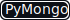
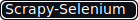

# Получение информации об имеющихся стратегиях с сайта "comon.ru"







### Получаем данные:
- id стратегии
- ссылка на стратегию
- название стратегии
- ссылка на автора стратегии
- автор стратегии
- количество подписчиков
- доходность за год
- минимальная сумма
- максимальная просадка
- риск
- описание

### Обработанные данные сохраняем в базу данных MongoDB.
**comon_db**

---
## Для работы необходимо:

1. Установить **scrapy**, **selenium**, **scrapy-selenium** и **pymongo**:
```commandline
pip install scrapy
pip install selenium
pip install scrapy-selenium
pip install pymongo
```
или из файла ```requirements.txt```:
```commandline
pip install -r requirements.txt
```
или
```commandline
python -m pip install -r requirements.txt
```

2. Скачать и распаковать драйвер для вашего браузера в папку с проектом ```strategiesparser/```

*Можно найти на странице: https://www.selenium.dev/documentation/webdriver/getting_started/install_drivers/*

3. Запустить контейнер с MongoDB:
```commandline
docker run -d --name mongo_scrap -p 27017:27017 -v mongodb_scrap:/data/db mongo
```

4. В файле ```strategiesparser/settings.py``` необходимо указать IP-адрес и порт сервера MongoDB:
```python
# Настройки для MongoDB:
MONGO_HOST = '192.168.2.230'
MONGO_PORT = 27017
```
Так же можно указать свою базу данных (comon_db):
```python
MONGO_DATABASE = 'comon_db'
```
и свою коллекцию:
```python
MONGO_COLLECTION = 'strategies'
```

5. запустите ```strategiesparser/runner.py```
